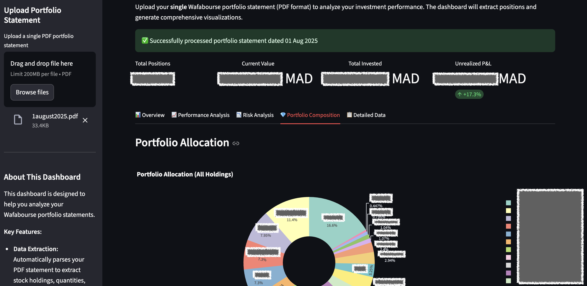

# Portfolio Analytics Dashboard

This Streamlit Application provides a comprehensive dashboard for analyzing investment portfolios, specifically designed to parse and visualize data from Wafabourse portfolio statements in PDF format.



## Features

*   **PDF Parsing:** Upload your Wafabourse portfolio statement (PDF) and automatically extract stock holdings, quantities, current prices, and purchase reference prices (PRMP).
*   **Performance Analysis:** Visualize portfolio performance with waterfall charts, identify top winners and underperformers, and analyze performance distributions.
*   **Risk Assessment:** Evaluate the risk-return profile of your investments using interactive scatter plots that consider holding weight and performance.
*   **Portfolio Composition:** Understand your portfolio's structure through allocation pie charts, treemaps, and breakdowns by holding size (value and count).
*   **Detailed Reporting:** View a sortable summary table of all positions and download the processed data as a CSV file.
*   **Actionable Insights:** Get summarized metrics and textual analysis to understand your portfolio's health.

## How to Use

1.  **Obtain Statement:** Get your portfolio statement PDF from the Wafabourse platform.
2.  **Access Dashboard:** Navigate to the deployed dashboard URL (once deployed) or run it locally (see below).
3.  **Upload PDF:** Use the file uploader in the sidebar to upload your Wafabourse portfolio statement PDF.
4.  **Analyze:** Explore the different tabs (`Overview`, `Performance Analysis`, `Risk Analysis`, `Portfolio Composition`, `Detailed Data`) to view visualizations, metrics, and insights.
5.  **Download Data:** If needed, download the extracted portfolio data as a CSV file from the `Detailed Data` tab.

## Deployment

This App is designed for deployment on [Streamlit Community Cloud](https://streamlit.io/cloud).

### Prerequisites

*   A GitHub account.
*   This code repository is hosted on GitHub (public).

### Steps

1.  Fork or ensure this repository is on your GitHub account.
2.  Sign in to [Streamlit Community Cloud](https://streamlit.io/cloud) using your GitHub account.
3.  Click "New App".
4.  Select this GitHub repository.
5.  Ensure the branch is set correctly (e.g., `main`).
6.  Set the "Main file path" to `App.py`.
7.  Optionally, customize the App name and URL slug.
8.  Click "Deploy".

Streamlit will automatically install dependencies listed in `requirements.txt` and deploy your App.

## Running Locally (For Development/Testing)

### Prerequisites

*   Python 3.8 or later installed on your system.
*   `pip` (Python package installer).

### Steps

1.  **Clone the Repository:**
    ```bash
    git clone https://github.com/your-username/your-repo-name.git
    cd your-repo-name
    ```
2.  **Create a Virtual Environment (Recommended):**
    ```bash
    python -m venv venv
    # Activate the virtual environment
    # On Windows:
    venv\Scripts\activate
    # On macOS/Linux:
    source venv/bin/activate
    ```
3.  **Install Dependencies:**
    ```bash
    pip install -r requirements.txt
    ```
4.  **Run the App:**
    ```bash
    streamlit run App.py
    ```
5.  Your default web browser should open automatically, displaying the dashboard. If not, navigate to the URL provided in the terminal (usually `http://localhost:8501`).

## Dependencies

The Application relies on the following Python libraries, which are listed in `requirements.txt`:

*   `streamlit`: For building and running the web Application.
*   `pymupdf` (PyMuPDF): For parsing PDF files and extracting tables and text.
*   `pandas`: For data manipulation and analysis.
*   `plotly`: For creating interactive charts and visualizations.

## Project Structure

portfolio-dashboard/
├── App.py # Main Streamlit application script.
├── requirements.txt # List of required Python packages.
├── README.md # This file.
└── .gitignore # (Optional) Specifies files/folders Git should ignore (e.g., venv/, *.pyc).


## Contributing

Contributions are welcome! Please feel free to submit issues or pull requests.

## License

This project is licensed under the MIT License.
